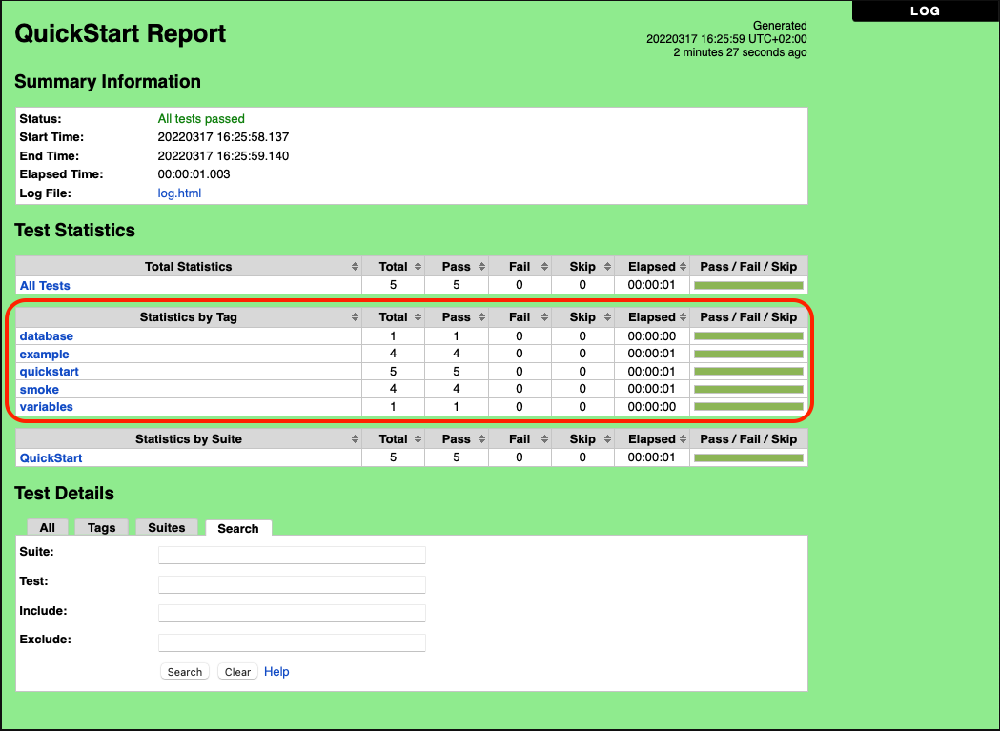
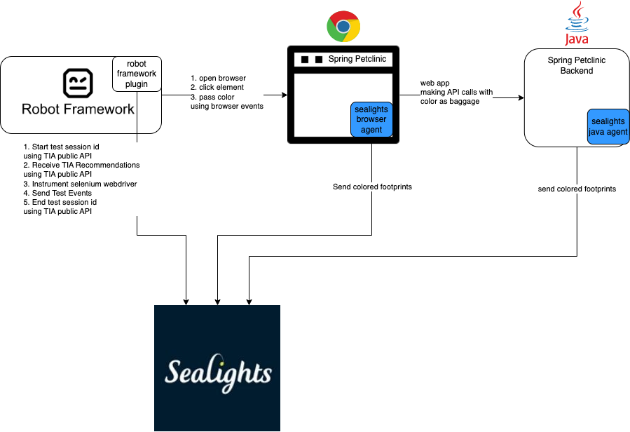

# Using SeaLights Test Optimization with Robot framework

This is a demonstration of applying SeaLights with Test Optimization to tests in the Robot framework (Python).

>For more information about Robot Framework Interfaces, please refer to the official documentation: [Robot Framework User Guide](https://robotframework.org/robotframework/latest/RobotFrameworkUserGuide.html#listener-interface)

## SeaLights integration

The SeaLights integration is implemented in the file `SLListener.py`. It provides an implementation of Robot's
Listener interface to facilitate calls to SeaLights API at appropriate phases of the test suite's lifecycle:
- `start_suite` -- here we do two things:
  - initialize the test session so that all the tests can be identified by SeaLights as being part of the same session 
  - request the list of tests to be executed from SeaLights and narrow the test suite to only them
- `end_suite` -- here we do two things: 
  - we collect and report test results including start and end time to SeaLights
  - close the test session
- `start_test` - here we start an OpenTelemetry span with the test name and session id as [baggage](https://opentelemetry.io/docs/reference/specification/baggage/api/).
   
   This will increase accuracy for the coverage to test correlation and will lead to more test savings.
- `end_test` - here we end the span that was opened in the beginning of the test. 

## Using the SeaLights Listener 
* Install the dependencies located in setup.py


* Install active opentelemetry instrumentation libraries
  `opentelemetry-bootstrap --action=install`

  This commands inspects the active Python site-packages and figures out which instrumentation packages the user might want to install. By default it prints out a list of the suggested instrumentation packages which can be added to a requirements.txt file. It also supports installing the suggested packages when run with --action=install flag.


* The listener is taken into use from the command line with the `--listener` option so that the name of the listener is given to it as an argument. Additional command arguments are specified after the listener name (or path) using a colon (`:`) as a separator
  * Token
  * buildSessionId
  * Test Stage name
  * (Optional) LabId

* If you have test cases that behave like test steps and use robot's report by tag then please use the "SLTagsListener"
  `--listener “SLTagsListener.py:<Token>:<buildSessionId>:<Test Stage Name>:<LabId>"`
  
* If you use robot's report by test case then please use the "SLListener"
  `--listener “SLListener.py:<Token>:<buildSessionId>:<Test Stage Name>:<LabId>"`

## Running the example with SeaLights

### Overview




### Steps

1. Clone Spring petclinic Java Backend Repo
   ```shell
   git clone https://github.com/spring-petclinic/spring-petclinic-rest
   ```
2. Clone Spring petclinic angular web app
   ```shell
   git clone https://github.com/spring-petclinic/spring-petclinic-angular
   ```
3. Download and unzip latest Java agent - https://agents.sealights.co/sealights-java/sealights-java-latest.zip
   ```shell
    cd spring-petclinic-rest
    wget -nv https://agents.sealights.co/sealights-java/sealights-java-latest.zip
    unzip -oq sealights-java-latest.zip
    download sltoken.txt from sealights dashboard settings-> Agent Tokens
    ```
   * Follow the steps to create a session, scan and run unit tests on the java backend [here](https://sealights.atlassian.net/wiki/spaces/SUP/pages/3130949633/Scanning+Builds+and+Capturing+Unit+Tests+using+the+SeaLights+Maven+plugin)
   * Run the backend application with coloring
     ```shell
      java -jar -javaagent:sl-test-listener.jar -Dsl.log.level=debug -Dsl.log.toFile=true  -Dsl.log.toConsole=true -Dsl.tokenFile=sltoken.txt -Dsl.buildSessionIdFile=buildSessionId.txt -Dsl.labId=<integ lab id from sealights -> settings -> integration lab ids> -Dsl.featuresData.codeCoverageManagerVersion=V2 -Dsl.otel.enabled=true target/spring-petclinic-rest-2.6.2.jar
     ```
4. Install latest JavaScript Agent
    ```shell
    cd spring-petclinic-angular
    download sltoken.txt from sealights dashboard settings-> Agent Tokens
    npm install
    npm install slnodejs
    npm run build
    ./node_modules/.bin/slnodejs config --tokenfile sltoken.txt --appname "spring-petclinic-angular" --branch "master" --build "1"
    npx slnodejs scan --workspacepath ./dist --tokenfile sltoken.txt --buildsessionidfile buildSessionId --labid <integ lab id from sealights -> settings -> integration lab ids> --es6Modules --scm none --enableOpenTelemetry --instrumentForBrowsers --outputpath "sl_web"
    ./node_modules/.bin/httpster -p 4200 -d sl_web
    ```
5. Open up a browser on localhost:4200 (our agent will be downloaded and started)
6. Create an integration build
   ```shell
    curl --location --request POST 'https://<devlab>-gw.dev.sealights.co/sl-api/v1/agent-apis/lab-ids/<integration-lab-id>/integration-build' \
    --header 'Content-Type: application/json' \
    --header 'Accept: application/json' \
    --header 'Authorization: Bearer <agent token>' \
    --data-raw '{
      "buildName": "<unique build name>"
    }'
   ```
   You should get a response with a new build session id. Use this build session id to run the tests
7. To apply the listener to tests use the following command:
    ```
    robot --listener "SLListener.py:${SL_TOKEN}:${SL_BUILD_SESSION_ID}:Robot Tests:${SL_LAB_ID}" selenium_tests.robot
    ```
    or 
    ```
    robot --listener "SLListener.py:`cat sltoken.txt`:`cat buildSessionId.txt`:Robot Tests" selenium_tests.robot
    ```

    The `SLListener`'s constructor requires the SeaLights token and build session id, in the above command it is assumed
    that these values can be found in files `sltoken.txt` and `buildSessionId.txt`.
